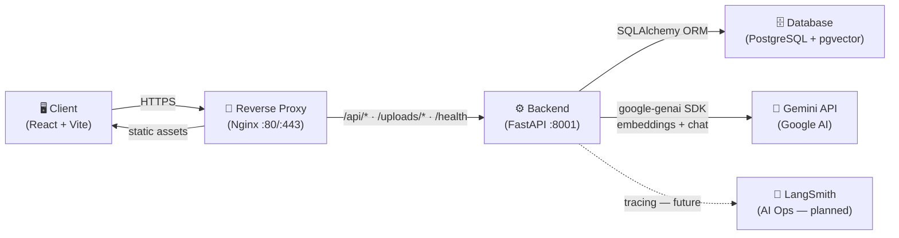

# AI Study Partner — System Architecture

> **Single source of truth for the project's architecture.** This file replaces the previous split between `SYSTEM_ARCHITECTURE.md` and `ARCHITECTURE_SUMMARY.md` (merged on 2026-05-04 — see `CHANGES.md`).
>
> **Maintenance Rule:** Update this file whenever a new file is created, a file is deleted, a core data structure changes, a router is added, or routing/state management is altered.

--

## Table of Contents

1. [Project Overview](#1-project-overview)
2. [Tech Stack & Environment](#2-tech-stack--environment)
3. [Visual Overview](#3-visual-overview)
4. [Directory Tree](#4-directory-tree)
5. [Backend File Index](#5-backend-file-index)
6. [Frontend File Index](#6-frontend-file-index)
7. [Multi-Tenant CAS Architecture (Document Storage)](#7-multi-tenant-cas-architecture-document-storage)
8. [Folder / Course Architecture](#8-folder--course-architecture)
9. [Core Data Flows](#9-core-data-flows)
10. [Architecture Decision Records (ADRs)](#10-architecture-decision-records-adrs)
11. [Future Roadmap](#11-future-roadmap)
12. [Key Architectural Decisions & Constraints](#12-key-architectural-decisions--constraints)

---

## 1. Project Overview

AI Study Partner is a web application that lets students study PDF documents alongside AI agents ("Personas") that guide learning through conversation. Users upload documents, pick or clone a study persona (Socratic mentor, course TA, etc.), and chat in a thread tree that is anchored to specific pages and selected text. Session memory can be compressed and written back into a persona's system prompt so the agent "remembers" the student across sessions.

A standout feature is **Thread Forking** — a Git-like branching mechanism that lets users fork a conversation from any specific message, enabling deep dives into sub-topics without losing the context of the original learning thread.

---

## 2. Tech Stack & Environment

| Layer | Technology | Local Port |
|---|---|---|
| Frontend | React 19 + TypeScript + Vite + TailwindCSS | 5173 (dev) / 80 (Docker) |
| State | Zustand (`useAppStore`) + React hooks | — |
| **Unified API** | **FastAPI + SQLAlchemy (all routes)** | **8001** |
| Database | PostgreSQL 16 + pgvector | 5433 (host) |
| LLM | Multi-provider: **OpenAI** (`openai`), **Anthropic** (`anthropic`), **Google Gemini** (`google-genai`) — routed via `llm_providers.py`; Gemini is the fallback | — |
| Reverse Proxy | Nginx | 80 / 443 |
| Container | Docker Compose | — |
| Package mgmt | npm (frontend) / UV (backend) | — |

**Key environment variables:** `VITE_AI_API_URL` (the only API base — port 8001 locally, domain root in production), `GOOGLE_API_KEY`, `OPENAI_API_KEY` (optional — enables ChatGPT), `ANTHROPIC_API_KEY` (optional — enables Claude), `DATABASE_URL`, `SECRET_KEY`, `ALLOWED_ORIGINS`. Missing provider keys fall back to Gemini automatically.

**Local dev:** `VITE_AI_API_URL=http://localhost:8001` (calls backend directly).
**Production:** `VITE_AI_API_URL=https://<your-domain>` (Nginx routes `/api/*`, `/uploads/*`, `/health` to `backend:8001`).

**Docker Compose — 3-File Architecture:**

| File | Purpose | Usage |
|---|---|---|
| `docker-compose.yml` | Shared base — services, container names, build contexts, restart policies, internal `DATABASE_URL`, uploads volume | Always loaded |
| `docker-compose.override.yml` | Dev overrides — GPU `deploy` block, hot-reload volumes (`./backend/app`), local port bindings (`8001:8001`, `5433:5432`). **Git-ignored** | Auto-merged by `docker compose up` |
| `docker-compose.prod.yml` | Production overrides — SSL volumes (`/etc/letsencrypt:ro`), port bindings (`80:80`, `443:443`), `VITE_AI_API_URL=https://<domain>` | `-f docker-compose.yml -f docker-compose.prod.yml` |

**Dev command:** `docker compose up --build`
**Prod command:** `docker compose -f docker-compose.yml -f docker-compose.prod.yml up -d --build`

---

## 3. Visual Overview



---

## 4. Directory Tree

```
AI_Study_Partner/
├── SYSTEM_ARCHITECTURE.md        ← this file (single source of truth)
├── CHANGES.md                    ← record of structural cleanup (2026-05-04)
├── CLAUDE.md                     ← Claude Code project directives
├── README.md                     ← Quick start
├── docker-compose.yml            ← shared base (all environments)
├── docker-compose.override.yml   ← dev overrides (git-ignored; auto-merged on `up`)
├── docker-compose.prod.yml       ← production overrides
│
├── ai-study-client/              ← React frontend
│   ├── src/
│   │   ├── App.tsx
│   │   ├── main.tsx
│   │   ├── index.css
│   │   ├── store/useAppStore.ts
│   │   ├── services/api.ts
│   │   ├── hooks/                ← useAuth, useChat, useDocuments, useFolders
│   │   ├── types/                ← index.ts, persona.ts
│   │   ├── data/mocks/           ← mockPersonas.ts (dev only)
│   │   ├── features/             ← domain components (DDD)
│   │   │   ├── personas/components/
│   │   │   ├── chat/components/
│   │   │   ├── documents/components/
│   │   │   └── sessions/components/
│   │   ├── components/
│   │   │   ├── layout/
│   │   │   └── ui/
│   │   └── utils/                ← fileIcons.tsx, formatters
│   ├── nginx.conf
│   ├── Dockerfile.frontend
│   ├── package.json
│   ├── tailwind.config.js
│   └── vite.config.ts
│
└── backend/                      ← Unified API (port 8001)
    ├── Dockerfile.backend
    ├── pyproject.toml            ← uv-managed dependencies
    ├── app/                      ← All active application code
    │   ├── main.py               ← FastAPI entry point; all routers, lifespan, CORS, StaticFiles
    │   ├── core/
    │   │   ├── config.py         ← settings, ALLOWED_ORIGINS, SECRET_KEY
    │   │   ├── database.py       ← SQLAlchemy engine + get_db()
    │   │   └── security.py       ← bcrypt + JWT
    │   ├── schemas/
    │   │   ├── schemas.py        ← Core Pydantic request/response models
    │   │   └── personal_hub.py   ← Profile / courses / jobs schemas
    │   ├── api/routers/
    │   │   ├── auth.py           ← /api/v1/auth — register, login, guest-login, get_current_user
    │   │   ├── documents.py      ← /api/v1/documents — upload, list, delete, summaries, visibility, folder move
    │   │   ├── threads.py        ← /api/v1/threads — create, get, fork, add messages
    │   │   ├── personas.py       ← /api/v1/personas — CRUD + clone + seed
    │   │   ├── chat.py           ← /api/v1/chat — standalone AI chat (no PDF)
    │   │   ├── folders.py        ← /api/v1/folders — folder CRUD (course/subject containers)
    │   │   └── personal_hub.py   ← /api/v1/profile — user profile, courses, jobs, transcript parsing
    │   ├── models/
    │   │   └── domain.py         ← All ORM models (User, BaseDocument, UserDocument, Folder, Thread,
    │   │                            Message, Chunk, PageSummary, Persona, StudySession, SessionMemory,
    │   │                            UserProfile, CourseRecord, JobApplication, LectureVideo, VideoSyncIndex)
    │   ├── services/
    │   │   ├── document_service.py ← PDF/DOCX/code extraction, chunking, RAG, prompt assembly
    │   │   ├── genai_client.py     ← google-genai SDK singleton
    │   │   ├── llm_providers.py    ← Multi-provider router: OpenAI / Anthropic / Gemini
    │   │   ├── model_router.py     ← Alias registry + tier routing (Gemini aliases)
    │   │   └── prompt_builder.py   ← system_prompt → manual_prompt_override → default + SessionMemory
    │   └── db/seeds/
    │       └── seed_personal_hub.py
    └── alembic/
        ├── env.py
        └── versions/             ← Migration scripts
```

---

## 5. Backend File Index

### Core

**`backend/app/main.py`** — Single FastAPI entry point. Lifespan: enables pgvector extension, seeds canonical personas, reconciles orphaned upload files. Mounts all seven routers plus `/uploads` StaticFiles. CORS from `config.py`.

**`backend/app/core/config.py`** — Reads `.env` via `python-dotenv`. Exports `DATABASE_URL`, `GOOGLE_API_KEY`, `OPENAI_API_KEY`, `ANTHROPIC_API_KEY`, `ALLOWED_ORIGINS`, `SECRET_KEY`, `ALGORITHM`, optional `SENTRY_DSN`, `LANGSMITH_API_KEY`.

**`backend/app/core/database.py`** — SQLAlchemy engine (`pool_pre_ping=True`), `SessionLocal`, `Base`, and `get_db()` dependency. All routers import `get_db` from here.

**`backend/app/core/security.py`** — `verify_password`, `get_password_hash` (bcrypt), `create_access_token` (PyJWT). Reads `SECRET_KEY` and `ALGORITHM` from `config.py`. Imported by `auth.py`.

**`backend/app/core/quota_config.py`** — Tunable per-tier credit quotas + period length + USD-per-credit rate. `TIER_QUOTAS` has entries for `guest` / `free` / `plus` / `pro`; `PERIOD_SECONDS` is daily by default (86 400). Read-only in Phase 1 — phases 2–4 wire it into LLM call sites, quota enforcement, and the Settings usage bar.

### Schemas

**`backend/app/schemas/schemas.py`** — Core Pydantic request/response models: `UserCreate`, `UserResponse`, `MessageCreate`, `MessageResponse`, `ThreadCreate`, `ThreadResponse`, `DocumentResponse`, `VisibilityUpdate`, `PublicDocumentResponse`, `PageSummaryResponse`, `FullSummaryResponse`, `CustomSummaryRequest`. Imported by `auth.py`, `documents.py`, `threads.py`.

**`backend/app/schemas/personal_hub.py`** — Pydantic models for the Personal Hub feature: `UserProfileResponse`, `UserProfileUpdate`, `CourseRecordCreate`, `CourseRecordResponse`, `JobApplicationCreate`, `JobApplicationResponse`. Imported by `personal_hub.py`.

### Routers

**`backend/app/api/routers/auth.py`** — Mounted at `/api/v1/auth`. Routes: `POST /register`, `POST /login`, `POST /guest-login` (mints a unique `guest-<uuid>@studyagent.ai` user per call with `subscription_tier='guest'`), `POST /google` (verifies a Google ID token via `google-auth`, requires `email_verified`, links by `google_sub` then by email, otherwise creates a fresh account). Exports `get_current_user` FastAPI dependency (JWT decode → User row) — imported by every other authenticated router.

**`backend/app/api/routers/documents.py`** — Mounted at `/api/v1/documents`. Routes: `GET /` (user docs), `POST /` (upload + chunk + embed via the CAS pipeline), `GET /public`, `DELETE /{id}`, `PATCH /{id}/visibility`, `PATCH /{id}/folder` (move to folder), `POST /{id}/pages/{page}/summary` (per-page summary), `GET /{id}/summaries`, `POST /{id}/summary/all` (full-document summary — cached in `BaseDocument.global_summary`), `POST /{id}/summary/custom` (custom-instruction summary). Depends on `get_current_user` and `document_service.py`.

**`backend/app/api/routers/threads.py`** — Mounted at `/api/v1/threads`. Routes: `GET /document/{doc_id}`, `GET /{id}`, `POST /`, `POST /{id}/messages`, `POST /{id}/fork`. **All routes require `get_current_user` and filter on `Thread.user_id`**; cross-user reads return 404 (no existence leak). Calls `get_full_thread_history` and `get_chat_response_for_thread` from `document_service.py`.

**`backend/app/api/routers/personas.py`** — Mounted at `/api/v1/personas`. Full Persona CRUD: `GET /`, `POST /`, `PUT /{id}`, `DELETE /{id}`, `POST /{id}/clone`, `POST /seed`. **`GET /` returns global + community + the caller's own personal personas (filtered by `Persona.author_id`)**; `POST /` rejects non-personal types and stamps `author_id`; `PUT/DELETE` require ownership; `clone` of a personal persona is rejected unless the caller already owns it. `PersonaResponse` is camelCase — matches the frontend `Persona` interface directly. Hosts `_SEED_PERSONAS` (canonical seed data, idempotently inserted on lifespan startup).

**`backend/app/api/routers/chat.py`** — Mounted at `/api/v1/chat`. Standalone AI chat (no PDF). `ChatRequest` accepts `ai_provider` (`"openai"` | `"anthropic"` | `"gemini"`). Routes through `llm_providers.call_llm` — falls back to Gemini if requested provider key is absent. Uses `prompt_builder.resolve_system_prompt` and `model_router.resolve_alias` for the DB audit alias.

**`backend/app/api/routers/folders.py`** — Mounted at `/api/v1/folders`. Routes: `GET /` (list caller's folders — supports `?course_id=N` and `?top_level_only=true` filters), `POST /` (create — accepts optional `course_id` to nest under a course owned by the caller), `PUT /{id}` (update name / color / `is_starred` / `persona_id` / `course_id`), `DELETE /{id}` (deletes folder; nulls `folder_id` on its documents — they become "unfiled" rather than orphaned). Depends on `get_current_user`.

**`backend/app/api/routers/courses.py`** — Mounted at `/api/v1/courses`. Top-level Course entity: `GET /` (list caller's courses — owned + admin-assigned + starred), `GET /public` (public catalog with `is_starred` flag for the caller), `POST /` (create — visibility = `private` / `admin_assigned` / `public`), `GET /{id}` (read with access check), `PUT /{id}` (owner-only), `DELETE /{id}` (owner-only; detaches folders by nulling their `course_id`), `POST /{id}/star` (toggle starred-membership on public courses), `GET /{id}/syllabus` (cached extraction + topics + lecturers), `POST /{id}/syllabus` (attach a UserDocument as the course syllabus and run a one-time Gemini extraction; idempotent re-runs upsert topics/lecturers without losing manually-edited rows), `DELETE /{id}/syllabus` (detach; topics/lecturers are NOT auto-deleted). Depends on `get_current_user`.

**`backend/app/api/routers/sessions.py`** — Mounted at `/api/v1/sessions`. Read-only session ergonomics: `GET /` (list caller's root threads with first-message preview, message count, and resolved document title — newest first, paginated), `GET /search?q=...` (free-text scan over title + selected_text + message content), `DELETE /{id}` (deletes the root thread + every fork descended from it). Sessions are *created* via `/chat/` and `/threads/` — no creation route here. Depends on `get_current_user`.

**`backend/app/api/routers/library.py`** — Mounted at `/api/v1/library`. Backs the My Library "Sessions & Files" lane: `GET /recent` returns a tagged-union feed (`kind: 'session' | 'file'`) merging the caller's root threads with their unfiled UserDocuments, sorted by recency. Depends on `get_current_user`.

**`backend/app/api/routers/exams.py`** — Mounted at `/api/v1` (declares full paths). Routes: `GET /courses/{course_id}/exams` (list — any course reader), `POST /courses/{course_id}/exams` (owner-only upload that runs the full processing pipeline: text extraction → question parsing → batch embeddings → per-question tagging → no-LLM difficulty calibration; rolls back the row if zero questions are extracted), `GET /exams/{id}` (full detail with questions, tags, difficulty), `DELETE /exams/{id}` (owner-only; questions cascade). Depends on `get_current_user`.

**`backend/app/api/routers/personal_hub.py`** — Mounted at `/api/v1/profile`. Track D — Personal Hub & Academic Roadmap. Routes: `GET/PUT /profile` (auto-creates profile on first read), `GET/POST /profile/courses`, `PUT/DELETE /profile/courses/{record_id}`, `DELETE /profile/courses` (wipe-all), `GET/POST /profile/jobs`, `PUT /profile/jobs/{job_id}`, `POST /profile/transcript` (parses an uploaded BGU-style PDF transcript via `pdfplumber` + `python-bidi` and upserts course records). Depends on `get_current_user`.

### Services

**`backend/app/services/document_service.py`** — Functions: `ask_gemini`, `get_smart_model`/`get_fast_model`, `get_embedding_model`, `extract_text_from_pdf`, `extract_text_from_word`, `extract_text_from_code`, `extract_text` (dispatcher), `convert_to_pdf` (LibreOffice headless), `is_code_file`, `split_text_into_chunks`, `generate_document_summary`, `generate_code_summary`, `generate_specific_page_summary`, `generate_full_document_summary` (whole-doc, cached), `generate_custom_summary` (user-instruction guided), `generate_code_review`, `find_relevant_chunks`, `get_full_thread_history` (Python walk + SQL CTE hybrid), `get_chat_response_for_thread`, `generate_thread_metadata_background`, `compose_system_prompt` (legacy trait builder — kept for backward compat).

**`backend/app/services/prompt_builder.py`** — `resolve_system_prompt(persona_id, db, course_id=None)`. Three-layer composition: persona base prompt (`Persona.system_prompt` → `Persona.manual_prompt_override` → built-in default) → SessionMemory blocks (chronological) → optional `## COURSE CONTEXT` block from the course's cached syllabus extraction (via `services.syllabus_extractor.build_syllabus_system_block`).

**`backend/app/services/syllabus_extractor.py`** — `extract_syllabus(text)` runs a single Gemini call and returns the canonical structured dict (topics, books, lecturers, prerequisites, weekly_breakdown, course_code, institution, semester, language, grading_policy). `build_syllabus_system_block(extracted, title)` formats the extraction into a compact prompt block (300-800 tokens) injected into course-scoped chats by the prompt builder. `ask_gemini` is imported lazily inside `extract_syllabus()` to break a circular import (`document_service` already imports `prompt_builder`, which now imports this module).

**`backend/app/services/exam_processor.py`** — Three-pass token-efficient pipeline for ingesting an uploaded exam: `extract_questions(text)` is ONE Gemini call returning structured `{number, text, page, has_solution_inline, solution_text}` rows; `tag_question(question, course, db)` is ONE small Gemini call per question that picks topic ids + a question-type id from the existing per-course taxonomy and upserts new entries when nothing fits, plus emits a reference solution; `compute_difficulty_scores(course_id, db)` is a no-LLM step that re-calibrates difficulty across the course (centroid distance within question-type clusters, normalized 0..1) and refreshes `Exam.aggregate_difficulty`. `process_exam(exam, raw_text, db)` is the convenience entrypoint the router calls. Both LLM passes route through `services.llm_json.call_llm_for_json` (forces native JSON mode + retries + safe parse).

**`backend/app/services/llm_json.py`** — Shared "LLM-must-return-JSON" utilities. `safe_json_parse(raw)` strips whitespace, prose preambles, and markdown fences before calling `json.loads`; tolerant of every messy thing models do. `call_llm_for_json(llm_call, base_prompt, expected_type, …)` runs an N-attempt retry loop, appending a stricter "JSON only, no markdown" reminder to the prompt on retry, and raises `LLMJsonError` (with `reason`, `raw`, `attempts`) when no attempt succeeds. `user_message_for(error)` translates the technical reason into a user-friendly string the routers can return as the HTTP `detail`. Used by `syllabus_extractor`, `exam_processor` (both passes), and the transcript parser. **All LLM-JSON callers MUST go through this module — no raw `json.loads` on model output anywhere else.**

**`backend/app/services/document_service.py`** also exposes `ask_gemini_json(prompt, *, use_smart_model)` — a JSON-forced variant of `ask_gemini` that uses the genai SDK's `response_mime_type="application/json"` config so Gemini refuses to emit prose or markdown fences at the API level. Exceptions propagate (no Hebrew apology fallback) so the retry loop in `llm_json` can react.

**`backend/app/services/model_router.py`** — `MODEL_MANIFEST` alias registry (`DUST` / `SPARK` / `BREEZE` / `VOLT` / `ATLAS` / `INDEX` / `ECHO` / `BANANA` / `VEO`). `route_llm_request(task_type, tier)` returns a model string. `resolve_alias` returns the alias for DB storage. `_TIER_OVERRIDE_MAP` maps frontend tier values (`flash-lite` / `flash` / `pro`) to aliases.

**`backend/app/services/genai_client.py`** — `get_client()` returns a singleton `google-genai` SDK client configured with `GOOGLE_API_KEY`. Used by `llm_providers.py` (Gemini path) and `document_service.py`.

**`backend/app/services/llm_providers.py`** — Multi-provider LLM routing. `call_llm(provider, model_tier, system_prompt, history)` dispatches to OpenAI, Anthropic, or Gemini based on `provider` param and API key availability. `_PROVIDER_TIER_MAP` maps `flash-lite / flash / pro` to the correct model string per provider. Gemini is always the fallback.

### Models

**`backend/app/models/domain.py`** — Single source of truth for all ORM models. Includes: `User` (with `subscription_tier`, `auth_provider`, `google_sub`, **`home_organization_id`** [Phase 1]), **`Organization`** [Phase 1], **`Community`** [Phase 1], **`RoleAssignment`** [Phase 1, with platform-NULL-sentinel CHECK constraint], `BaseDocument`, `UserDocument` (+ Phase-1 `organization_id` denormalized scope), `Folder` (with optional `course_id`, + Phase-1 `community_id` / `organization_id`), `Course` (with `syllabus_user_document_id`, cached `syllabus_extracted` JSONB, + Phase-1 NOT-NULL `community_id` / `organization_id`), `CourseMembership` (legacy — Phase 6 will drop in favour of `RoleAssignment`), `CourseTopic`, `CourseLecturer`, `CourseQuestionType`, `Exam` (+ Phase-1 NOT-NULL `community_id` / `organization_id`), `ExamQuestion`, plus the `exam_lecturers` and `exam_question_topics` association tables, `Thread` (with `user_id`, `course_id`, + Phase-1 `community_id` / `organization_id`), `Message`, `Chunk`, `PageSummary`, `Persona`, `StudySession`, `SessionMemory`, `UserProfile`, `CourseRecord`, `JobApplication`, `LectureVideo`, `VideoSyncIndex`, `UsageEvent`. Three native PG enums declared at module top: `SCOPE_ENUM` / `ROLE_ENUM` / `GRANT_SOURCE_ENUM` (Phase 1). Alembic autogenerates migrations from this file.

---

## 6. Frontend File Index

### Directory Structure (Domain-Driven Design)

The frontend follows a feature-based DDD layout. Shared infrastructure (layout, hooks, store, types) lives at `src/`, while domain components are isolated under `src/features/`:

```
ai-study-client/src/
├── features/
│   ├── personas/components/   # PersonaLab, PersonaEditor, PublicGallery, SwitchPersonaModal
│   ├── chat/components/       # ChatPanel, BreadcrumbTree, MillerColumnsTree, NodeGraphTree
│   ├── documents/components/  # PdfViewer, CodeViewer, FileUploadView, DocumentPicker, DocCard
│   └── sessions/components/   # PreFlightModal, SessionWrapUpModal, ResumeToast
├── components/
│   ├── layout/                # AppLayout, MainWorkspace, Sidebar, MyLibrary, PageContainer, PageHeader, WorkspaceHeader, LandingPage, Settings
│   └── ui/                    # AuthModal, ConfirmModal, FolderModal, MoveToFolderModal
├── data/mocks/                # mockPersonas.ts (dev/test data only)
├── hooks/                     # useAuth, useDocuments, useChat, useFolders
├── store/                     # useAppStore (Zustand)
├── services/                  # api.ts (Axios client with token interceptor)
├── utils/                     # fileIcons.tsx, formatters
└── types/                     # index.ts, persona.ts
```

### Store & Services

**`src/store/useAppStore.ts`** — Global Zustand store. Owns `personas[]` (fetched from `/api/v1/personas`), `activeSession {documentId, personaId}` (persisted to localStorage), `selectedModelTier` (`flash-lite` | `flash` | `pro`), `selectedAIProvider` (`openai` | `anthropic` | `gemini`), `textSelection`, `showResumePrompt`. Key actions: `fetchPersonas`, `clonePersona`, `createPersona`, `updatePersona`, `deletePersona`, `saveSessionMemory`, `setSelectedAIProvider`. Called by almost every component and all hooks.

**`src/services/api.ts`** — Axios instance using `VITE_AI_API_URL` (unified API, port 8001). Injects `Authorization: Bearer <token>` on every request. All routes use `/api/v1/...` prefixes. Summary methods: `createPageSummary`, `getDocumentSummaries`, `createFullDocumentSummary`, `createCustomSummary`. Imported by every hook and `App.tsx`.

### Hooks

**`src/hooks/useAuth.ts`** — Manages `isAuthenticated`, `view` (which top-level page to show), `isAuthModalOpen`. Reads/writes `access_token` from localStorage. Drives the outer layout switch in `App.tsx`.

**`src/hooks/useChat.ts`** — Owns the thread/message lifecycle: `threads[]`, `activeThread`, `inputMessage`, `isSending`. Exposes `handleCreateThread`, `handleQuickAction`, `handleSmartAction`, `handleForkMessage`. Passes `selectedModelTier` + `selectedAIProvider` from the store to every `/api/v1/chat` request. Re-fetches threads whenever `documentId` prop changes.

**`src/hooks/useDocuments.ts`** — Owns document state: `file`, `documentId`, `numPages`, `currentPage`, `userDocs[]`, `docType` (memoized from extension). Handles upload (FormData to `/api/v1/documents/`), blob download via `/uploads/<path>`, visibility toggle, folder moves. Calls `fetchPersonas` on mount.

**`src/hooks/useFolders.ts`** — Owns folder state: `folders[]`, `activeFolderId`. Exposes `createFolder`, `updateFolder`, `deleteFolder`, `setActiveFolder`. Optimistic updates for star toggles with automatic rollback on API failure.

### Types

**`src/types/persona.ts`** — Defines `PersonaType` (`'global' | 'community' | 'personal'`), `TagCategory`, and the `Persona` interface. Field names are camelCase and mirror the backend `PersonaResponse` schema exactly — no transformation needed.

**`src/types/index.ts`** — Defines `Message` (`id, role, content`) and `Thread` (`id, page_number, selected_text, coordinates, messages[], parent_thread_id?, forked_from_message_id?, title?, emoji?`).

### Top-Level Components

**`src/App.tsx`** — Root component. Wires together `useAuth`, `useDocuments`, `useChat`, `useFolders`, and `useAppStore`. Owns session lifecycle handlers: `handleStartSession` (triggers clone for global/community personas), `handleSwitchPersona`, `handleResumeSession`, `handleWrapUpSave`. Controls modals (PreFlight, WrapUp, SwitchPersona). Renders `AppLayout` or `LandingPage` based on auth state.

**`src/features/personas/components/PersonaLab.tsx`** — Three-tab persona browser (Store / Community / My Personas). Renders `PersonaCard` grid and `PreviewPanel` slide-over. Opens `PersonaEditor` for edit or clone.

**`src/features/personas/components/PersonaEditor.tsx`** — Full-screen overlay for editing or cloning a persona. Left panel: name, icon, description, tags, system prompt textarea. Right panel: AI refinement chat (integration pending). Two save modes: "Apply to Session" (transient — no DB write) vs "Save Changes" / "Save as Clone".

**`src/features/chat/components/ChatPanel.tsx`** — Central study workspace panel. Three inner tabs: **Threads** (navigation), **Active Chat** (messages), **Summary** (AI summaries). Summary tab has three modes: *Current Page* (per-page, cached), *Summarize All* (full-document, cached in `BaseDocument.global_summary`), *Custom* (free-form instruction textarea). Tab switching is explicit only — no auto-switch on thread change. Renders `BreadcrumbTree`, `MillerColumnsTree`, or `NodeGraphTree` based on `treeViewMode`. Shows fork button on assistant messages, markdown + KaTeX message renderer.

**`src/features/chat/components/BreadcrumbTree.tsx` / `MillerColumnsTree.tsx` / `NodeGraphTree.tsx`** — Three interchangeable thread-navigation strategy components implementing the **Strategy Pattern**. Each receives `threads[]`, `activeThread`, `onSelectThread`, `onCreateThread`. Selected by user preference stored in `useAppStore`.

**`src/features/documents/components/PdfViewer.tsx`** — Renders PDF pages using `react-pdf`. Tracks visible page via `IntersectionObserver` (Scroll Spy). Handles text selection (stores bounding box in `useAppStore`). Draws purple overlay markers for threads on each page. Ctrl+wheel zoom.

**`src/features/documents/components/CodeViewer.tsx`** — Built on `@monaco-editor/react` (`readOnly: true`, bracket-pair colorisation). Language detected from filename via `LANGUAGE_MAP`. Text selection fires `onDidChangeCursorSelection`; pixel position resolved via `getScrolledVisiblePosition` with a container-center fallback. Pushes selected text to Zustand `textSelection`, identical to the PDF flow.

**`src/features/documents/components/FileUploadView.tsx` / `DocumentPicker.tsx` / `DocCard.tsx`** — Drag-and-drop upload, dropdown selector, and grid card respectively. Use `fileIcons.tsx` for type-aware icons.

**`src/features/sessions/components/PreFlightModal.tsx`** — Session start modal. Two modes: `from-doc` (document picked first → choose agent) or `from-persona` (agent picked first → choose document). Shows resume banner when a previous session exists for the same document.

**`src/features/sessions/components/SessionWrapUpModal.tsx`** — End-of-session memory compression modal. Lets user pick compression level (Deep / Thematic / Minimal) and write optional instructions. On save, appends a formatted block to `persona.systemPrompt`.

**`src/features/sessions/components/SwitchPersonaModal.tsx`** — Mid-session agent switch modal. Lists personal personas with mini cards. Optional "keep conversation context" toggle.

**`src/features/sessions/components/ResumeToast.tsx`** — Reads `showResumePrompt` from `useAppStore`. Shows a non-blocking toast once per app load if a previous session is stored in localStorage.

### Layout

**`src/components/layout/AppLayout.tsx`** — Two-column shell: `Sidebar` (left) + main content area (right).

**`src/components/layout/Sidebar.tsx`** — Navigation links (Library, Persona Hub, Gallery, Settings, Personal Hub), resume session button, logout. Reads auth state from `useAuth` and session state from `useAppStore`.

**`src/components/layout/MainWorkspace.tsx`** — Side-by-side layout: `PdfViewer` or `CodeViewer` (left, resizable based on `docType`) + `ChatPanel` (right).

**`src/components/layout/MyLibrary.tsx`** — Drive-style two-section workspace: **Courses** (folders) section above a **Files** section. Root view shows unfiled documents; clicking a folder filters to its contents.

**`src/components/layout/WorkspaceHeader.tsx`** — Expandable top bar during a session. Shows document title (with file-type icon). Expandable toolbar contains: Export Session, Save to Persona Memory, **AI provider selector** (ChatGPT / Claude / Gemini — writes `selectedAIProvider` to Zustand), and model tier selector (Fast / Balanced / Deep — writes `selectedModelTier`).

### UI

**`src/components/ui/AuthModal.tsx`** — Login / register / guest-login modal.

**`src/components/ui/FolderModal.tsx`** — Create/edit folder. Exposes name, color (Tailwind tokens), and `persona_id` dropdown for default-tutor binding.

**`src/components/ui/MoveToFolderModal.tsx`** — Move a document to a folder (or unfile it). Calls `PATCH /api/v1/documents/{id}/folder`.

### Utils

**`src/utils/fileIcons.tsx`** — Single source of truth that maps file extensions to Lucide icons and Tailwind color classes. Consumers: `DocCard`, `DocumentPicker`, `WorkspaceHeader`.

| Extension | Icon | Color |
|-----------|------|-------|
| `.pdf` | `FileText` | `text-rose-500` |
| `.docx` / `.doc` | `FileText` | `text-blue-500` |
| `.pptx` / `.ppt` | `Presentation` | `text-orange-500` |
| code files | `FileCode` | `text-amber-500` |
| other | `File` | `text-slate-400` |

---

## 7. Multi-Tenant CAS Architecture (Document Storage)

The document storage uses a **Content-Addressable Storage (CAS)** pattern: a file is stored on disk and embedded into vectors **once**, regardless of how many users upload it.

### The CAS Pipeline — How a File Upload Works

```
User uploads file.pdf
       │
       ▼
1. Backend computes SHA-256 hash of raw file bytes → hash_id = "a3f7c2..."
       │
       ├── hash_id EXISTS in basedocuments?
       │         │
       │         YES → skip re-processing (deduplication)
       │         NO  → INSERT INTO basedocuments
       │               (hash_id, original_filename, file_path, source_type="UPLOAD",
       │                doc_type="GENERAL", global_summary=null, metadata={})
       │               → chunk + embed → INSERT INTO chunks (base_hash=hash_id)
       │
       ▼
2. Always INSERT INTO userdocuments
   (user_id, base_hash=hash_id, custom_title=filename, is_public=false)
   → returns UserDocument.id to the frontend as the "document id"
```

### Table Ownership Model

| Table            | Belongs To   | Key Field              | Notes                                        |
|------------------|--------------|------------------------|----------------------------------------------|
| `basedocuments`  | Content      | `hash_id` (SHA-256)    | 1 row per unique file, shared across users   |
| `userdocuments`  | User         | `id` (Integer PK)      | 1 row per (user, file) pair                  |
| `chunks`         | Content      | `base_hash` → basedoc  | Embeddings shared; no re-indexing on clone   |
| `page_summaries` | Content      | `base_hash` → basedoc  | AI summaries cached at content level         |
| `threads`        | User         | `document_id` → userdoc | Conversations are private per workspace      |
| `study_sessions` | User         | `document_id` → userdoc | Session state is per user                    |

### Future-Proofing Fields

- **`source_type`** (`UPLOAD` | `DRIVE` | `MOODLE`): The ingestion path. Future integrations create `BaseDocument` rows with the appropriate source type without changing any downstream table.
- **`doc_type`** (`GENERAL` | `SOURCE_CODE` | `SYLLABUS` | `EXAM_RAW` | `EXAM_PROCESSED` | `LECTURE_TRANSCRIPT`): Enables type-specific RAG pipelines. `SOURCE_CODE` routes to `CodeViewer` instead of `PdfViewer`.
- **`parent_hash`** (self-FK on `basedocuments`): Links derivative content back to its origin — e.g., a cleaned `EXAM_PROCESSED` document back to the raw scan.
- **`metadata`** (JSONB, default `{}`): Schema-free tags for Course, Degree, University, Language, Year — queryable without schema migrations.
- **`ai_feedback`** (JSONB on `userdocuments`): Per-user ratings/corrections on AI summaries, feeding a future RL loop.
- **`folder_id`** (Integer FK on `userdocuments` → `folders.id`): NULL = "unfiled".
- **`is_starred`** (Boolean on `userdocuments`): User-level bookmark.

---

## 8. Folder / Course Architecture

### Data Model

```
folders
  id          INTEGER PK
  user_id     → users.id
  name        VARCHAR    (e.g. "Algorithms 2025", "Linear Algebra")
  color       VARCHAR    (hex or Tailwind token; nullable)
  is_starred  BOOLEAN    default false — pinned folders sort first
  persona_id  → personas.id  (default AI persona for this course; nullable)
  created_at  TIMESTAMPTZ

userdocuments
  ...
  folder_id   → folders.id  (nullable — NULL means unfiled)
  is_starred  BOOLEAN       default false — bookmarked documents
```

### CRUD API

| Method | Route                                  | Description                                       |
|--------|----------------------------------------|---------------------------------------------------|
| GET    | `/api/v1/folders/`                     | List caller's folders (starred first, then alpha) |
| POST   | `/api/v1/folders/`                     | Create a folder                                   |
| PUT    | `/api/v1/folders/{id}`                 | Update name / color / is_starred / persona_id     |
| DELETE | `/api/v1/folders/{id}`                 | Delete; sets `folder_id=NULL` on all its documents |
| PATCH  | `/api/v1/documents/{id}/folder`        | Move document to a folder (null = unfiled)       |

### Delete Safety

Deleting a Folder does **not** delete its documents. The router issues:

```sql
UPDATE userdocuments SET folder_id = NULL WHERE folder_id = :folder_id
```

before removing the folder row — documents become "unfiled" rather than orphaned.

### Design Rationale

- Integer PK (not UUID) — consistent with all other PKs in the schema.
- `persona_id` on `Folder` lets a course pre-configure its AI tutor (e.g. "BGU DS TA" for a Data Structures folder), which `PreFlightModal` can inherit when a user opens any document inside that folder.
- `is_starred` lives on both `Folder` and `UserDocument` independently — a user can star a single document without starring its whole folder.

---

## 9. Core Data Flows

### A. Starting a Session (from-doc path)
```
User clicks document in MyLibrary
→ PreFlightModal opens (mode='from-doc')
→ User selects a persona and clicks Start
→ App.handleStartSession(documentId, personaId) fires
→ If persona.type !== 'personal':
    clonePersona(personaId)
    → POST /api/v1/personas/{id}/clone
    → Backend creates Persona row (personal fork, new ID)
    → Returns saved clone; Zustand store updated
    personaId = clone.id
→ setActiveSession({documentId, personaId}) — written to localStorage
→ View switches to MainWorkspace
→ useChat fetches threads for documentId
```

### B. Creating / Editing a Persona
```
User opens PersonaEditor, edits fields, clicks Save
→ onSave(updated, transient=false) fires in PersonaLab.handleEditorSave
→ mode='clone':  createPersona(updated)
    → POST /api/v1/personas  (body: snake_case fields)
    → Backend inserts row, returns PersonaResponse
    → Zustand: temp ID swapped for real DB ID; activeSession patched
→ mode='edit':  updatePersona(updated.id, updated)
    → PUT /api/v1/personas/{id}  (body: only changed fields)
    → Backend updates row, returns PersonaResponse
    → Zustand: personas[] entry replaced with fresh server copy
→ editorState set to null (editor closes)
```

### C. Session Wrap-Up (memory compression)
```
User clicks End Session in WorkspaceHeader
→ SessionWrapUpModal opens
→ User picks compression level + writes instructions → Save
→ App.handleWrapUpSave(level, instructions)
→ saveSessionMemory(personaId, level, instructions) in useAppStore
    → Appends formatted memory block to persona.systemPrompt (local only)
    → NOTE: does not persist to DB — updatePersona should be called here (future work)
→ clearActiveSession() — removes from store + localStorage
→ View returns to MyLibrary
```

### D. Text Selection → Chat
```
User selects text on PDF page (or in CodeViewer)
→ onMouseUp / onDidChangeCursorSelection stores {text, x, y, width, height}
  in useAppStore.textSelection
→ Floating action overlay appears
→ User clicks Explain / Quiz / Chat
→ useChat.handleQuickAction(type) pre-fills prompt with selection context
→ handleCreateThread() called
    → POST /api/v1/threads/  (selected_text, coordinates, page_number)
    → POST /api/v1/threads/{id}/messages (initial message)
→ Thread added to tree; ChatPanel switches to Chat tab
→ LLM response streamed back
```

### E. Folder Move
```
User drags doc card to a folder (or uses MoveToFolderModal)
→ useFolders.moveDocument(docId, folderId | null)
→ PATCH /api/v1/documents/{id}/folder
→ Backend updates userdocuments.folder_id
→ Optimistic UI update; rollback on failure
```

---

## 10. Architecture Decision Records (ADRs)

Documenting the engineering dilemmas faced during development and the rationale behind chosen solutions.

### ADR 1: Local AI Models vs. Cloud API (LLM)
- **Dilemma:** Initially, local models via LM Studio and HuggingFace (`langchain-huggingface`) generated thread titles, emojis, and chat completions.
- **Problem:** Heavy ML libraries (PyTorch) alongside FastAPI in Docker on WSL2 caused severe memory bottlenecks and Out-Of-Memory crashes on standard machines (4 GB RAM).
- **Decision:** **Migrate to Cloud API (Google Gemini).**
- **Trade-offs:** *Pros:* drastically reduced backend memory footprint, eliminated OOM crashes, sub-30-second container builds. *Cons:* vendor lock-in to Google, internet dependency, rate-limit risk. Mitigated via DB caching for generated summaries.

### ADR 2: The Embeddings Engine
- **Dilemma:** Convert document chunks to vectors for semantic search without exhausting server resources.
- **Options:** HuggingFace `sentence-transformers` (rejected — RAM); ONNX Runtime (privacy-good but model-maintenance overhead); Cohere API (second vendor); Google Gemini Embeddings (`text-embedding-004`, 768-dim).
- **Decision:** **Google Gemini Embeddings API.**
- **Trade-offs:** Reliance on Google free-tier quota (~1500 RPM); LangChain batching keeps us well below the ceiling. Zero RAM cost for embeddings.

### ADR 3: Vector Search Calculation (Scikit-Learn vs. pgvector)
- **Dilemma:** Where to compute cosine similarity between query and chunk embeddings.
- **Decision:** **Migrate from in-memory `sklearn` + `numpy` to native `pgvector`.**
- **Trade-offs:** Pulling thousands of vectors into Python RAM is an anti-pattern at scale. Offloading to PostgreSQL (`ORDER BY embedding <=> query_vector`) keeps FastAPI stateless and scalable, at the cost of learning advanced SQLAlchemy syntax for vector queries.

### ADR 4: Cloud Infrastructure & Deployment Provider
- **Dilemma:** Where to host the Dockerized stack (FastAPI, React, PostgreSQL).
- **Options:** DigitalOcean (clean DX); AWS EC2 free-tier `t2.micro`/`t3.micro` (industry standard, 1 GB RAM ceiling); GCP/Azure.
- **Decision:** **AWS EC2** for resume value; DigitalOcean is documented as a parallel viable option in the deployment guide.
- **Trade-offs:** *Pros:* exposure to industry-standard tools (IAM, Security Groups, Elastic IPs). *Cons:* 1 GB RAM ceiling on free tier. *Mitigation:* manually configure a Linux Swap File to offload idle pages to SSD.

### ADR 5: LLM Token Cost Management & Latency
- **Dilemma:** Generating per-page summaries on upload is slow and burns through API quota.
- **Decision:** **Gatekeeper pattern with Lazy Loading + DB persistence.**
- **Trade-offs:** Summaries are computed on-demand with upfront cost estimation and explicit user approval, then persisted to `page_summaries`. Returning users hit zero API cost. Trade-off: increased backend complexity (cache table, gating logic).

### ADR 6: Authentication & "Showcase" Mode
- **Dilemma:** Strict registration creates friction for portfolio reviewers; open endpoints invite abuse.
- **Decision:** **Frontend-driven Guest/Demo Mode backed by FastAPI JWT.** Frontend attempts to log in a predefined "Demo User"; if it doesn't exist, registers it automatically.
- **Trade-offs:** One-click showcase, fully JWT-guarded backend.

### ADR 7: API Call Optimization (Zero-Shot JSON)
- **Dilemma:** Generating thread title + emoji used multiple sequential API calls, causing UI lag.
- **Decision:** **Single Zero-Shot prompt returning typed JSON** (`{"title": "...", "emoji": "..."}`).
- **Trade-offs:** Halved API latency at the cost of stricter JSON parsing error handling on the backend.

### ADR 8: Backend Resource Management (Garbage Collection)
- **Dilemma:** Uploaded files and deleted threads can leave orphaned PDFs on disk.
- **Decision:** **Automated server-side GC** in the lifespan startup hook — scans `uploads/` and removes files with no matching `BaseDocument.file_path`.

### ADR 9: Security, Routing & Web Server (DevOps Phase)
- **Dilemma:** Securely expose the Dockerized app on the public internet with a custom domain and SSL, without conflicts between Docker and Let's Encrypt.
- **Decision:** **Cloudflare Proxy + Nginx Reverse Proxy with Host-Level Certbot.**
- **Implementation:** Defensive domain registration (plural variant); Certbot in `standalone` mode on the host (briefly freeing port 80); SSL certs mounted into the Nginx container as read-only volumes; Cloudflare Full (Strict) SSL with proxy on (orange cloud) for IP shielding and DDoS protection.

### ADR 10: Drive UI — Folder-First Library
- **Problem:** Flat document lists don't scale past ~20 files.
- **Decision:** Two-level Drive-style workspace — Courses (folders) section above a Files section.
- **Key Choices:** Root shows *unfiled* documents; clicking a folder filters to its contents (Drive-style, not tag-style). `Folder.persona_id` pre-configures the AI tutor for a course. Star state is independent on Folder vs. UserDocument. Optimistic star toggles with rollback.
- **New modules:** `useFolders` hook; `FolderCard`, `FolderGrid`, `FolderModal`, `MoveToFolderModal`.

### ADR 10b: Office Document Support (DOCX + PPTX → PDF via LibreOffice)
- **Problem:** `react-pdf` cannot render Office binary formats; need server-side conversion.
- **Decision:** **LibreOffice headless** at upload time. `BaseDocument.file_path` is the converted PDF; the frontend always renders through `<PdfViewer>`.
- **Implementation:** `libreoffice`, `fonts-liberation`, `fonts-dejavu-core` in `Dockerfile.backend`. `convert_to_pdf` runs LibreOffice as a subprocess (120 s timeout); raises `RuntimeError` (HTTP 500) if exit code is non-zero or output file is missing — with a 5×0.5 s retry loop covering Docker-volume flush lag.
- **Text extraction order:** `.docx` → `extract_text_from_word` (paragraph-level via python-docx) → then convert for display. `.pptx` → convert first → `extract_text_from_pdf` on the converted PDF.

### ADR 10c: Smart File-Type Icons (FileIcon utility)
- **Problem:** A flat library with one `FileText` icon gives no visual distinction.
- **Decision:** `src/utils/fileIcons.tsx` — single source of truth mapping extensions to Lucide icons and Tailwind colors. See table in §6 above.

### ADR 10d: Code Learning Environment (Monaco Editor + doc_type routing)
- **Problem:** Source code is meaningless when rendered through `react-pdf` — needs syntax highlighting, monospace font, code-aware selection.
- **Decision:** New `doc_type` field on `BaseDocument` (`GENERAL` | `SOURCE_CODE`). Backend determines on upload by extension. `MainWorkspace` switches between `<PdfViewer>` and `<CodeViewer>` based on `doc.docType`.
- **Implementation:** `CODE_EXTENSIONS` frozenset in `document_service.py`. `extract_text_from_code` wraps the file in a `=== File: filename ===` header for RAG context. `generate_code_summary` uses a Software-Architect system prompt. `CodeViewer` is `@monaco-editor/react` (`readOnly: true`, bracket-pair colorisation). Selection fires `onDidChangeCursorSelection`; pixel position via `getScrolledVisiblePosition` (cast to any; not in public Monaco types) with container-center fallback. Selection pushed to Zustand identical to the PDF flow. Code-specific smart actions (Explain / Find bugs / Refactor) above the standard quick-actions row.

### ADR 10e: RTL Language Support (Hebrew PDF Extraction)
- **Dilemma:** Standard parsers extract RTL languages backwards because PDFs store visual coordinates, not logical text flow.
- **Decision (planned):** Advanced parsing with `pdfplumber` + `python-bidi` for logical reversal and cleanup.
- **Trade-offs:** Perfect Hebrew extraction; slight processing-time increase and additional library dependency.

### ADR 11: Multi-Modal RAG (Images, Graphs, Formulas)
- **Dilemma:** Standard RAG only extracts raw text. Educational PDFs lose formulas, diagrams, charts.
- **Options:** OCR (destroys structure); layout parsers like Nougat (GPU-required, incompatible with cost-effective hosting); Vision LLMs (perfect understanding but expensive and slow).
- **Decision (planned):** **Hybrid Pipeline** — extract standard text + identify image/graph bounding boxes via object detection + send only those crops to a Vision LLM for textual descriptions, then inject those descriptions as standard text chunks.
- **Trade-offs:** Maximum semantic fidelity at controlled token cost; significantly increased processing-pipeline complexity.

### ADR 12: Multi-Format Document Support (Word, PPTX, CSV)
- **Dilemma:** Browsers can't uniformly render Word/PPTX alongside the React chat UI without heavy third-party wrappers.
- **Decision (planned):** **Server-Side Conversion to PDF.** UI stays clean and exclusively `react-pdf`-based.

---

## 11. Future Roadmap

### Phase 2 — AI Agents Marketplace
**Objective:** Evolve the single-agent learning tool into a role-based educational platform.

- **Architecture (Separation of Concerns):** Use a secondary, defensively-registered domain (`ai-study-agents.com`) to build a fast, lightweight Static Site (SSG) acting as a visual catalog of "Expert Tutors" (Data Engineering Mentor, Math Tutor, etc.).
- **The Handshake:** When a user picks a persona from the catalog, redirect to the main app (`ai-study-agent.com`) via URL query parameters (`?persona=data_engineer`).
- **Dynamic Context Injection:** The main FastAPI backend intercepts the parameter, retrieves the deep system prompt from the database, and initializes the Gemini chat strictly within that persona's boundaries. The core engine stays generic and scalable.

### Other Planned Tracks
- Persistence of `SessionMemory` writes on wrap-up (currently local-only — see §12).
- LangSmith integration for prompt tracing & RAG evaluation (env var stub already wired in `config.py`).
- Sentry error tracking (DSN stub already wired in `main.py`).
- Lecture video sync (`LectureVideo`, `VideoSyncIndex` tables already present).

---

## 12. Key Architectural Decisions & Constraints

| Decision | Reason |
|---|---|
| ~~Dual backends~~ → Single backend on 8001 | Phase 1 consolidation complete; legacy `main`/`models`/`schemas`/`services.py` deleted |
| String PKs for Persona | Allows seeding with human-readable IDs (`global_socratic_mentor`) |
| camelCase in PersonaResponse | Frontend uses the JSON directly without transformation |
| Optimistic clone flow | `clonePersona()` must complete before session starts to avoid FK violations |
| `activeSession` in localStorage | Survives page reload; validated against DB on `fetchPersonas` |
| `saveSessionMemory` is local-only | Memory is appended to Zustand state but not yet PUT to DB on wrap-up |
| `SessionMemory.persona_id` is NOT NULL | Hard-delete required before persona delete (cannot null-out the FK) |
| Nginx routes `/api/`, `/uploads/`, `/health` to `backend:8001` | Single proxy target; frontend JS bundle never contains internal hostnames |
| `VITE_AI_API_URL=https://<domain>` in production | Domain-root base URL + hardcoded `/api/v1/` paths = no per-env path config |
| Docker Compose 3-file architecture | Base + dev override (git-ignored) + prod override |
| pgvector cosine distance for RAG | DB-side computation keeps FastAPI stateless |
| LibreOffice headless for Office conversion | Keeps UI exclusively `react-pdf`-based |
| `doc_type` field switches viewer | `GENERAL` → `<PdfViewer>`, `SOURCE_CODE` → `<CodeViewer>` |
| Folder delete = null FKs, don't cascade | Documents become unfiled rather than orphaned |
| Cross-user reads return 404, not 403 | Avoids leaking the existence of another user's row to ID-enumeration probes |
| Each `/auth/guest-login` mints a fresh user | Prior shared-guest behaviour caused all reviewers to see each other's data |
| `Thread.user_id` is the authoritative ownership field | Both doc-anchored and standalone chat threads carry it; document_id alone is insufficient (NULL for /chat threads) |
| Personal personas with `author_id IS NULL` are dead data | Pre-existing legacy rows from before ownership enforcement; invisible everywhere by design |
| `cost_usd_micros` is BIGINT, not INT | INT32 max is 2.147 B micros (~$2,147 aggregate) — overflows fast |
| Course → Folder → Document/Session hierarchy | Folder.course_id is nullable: a folder is either nested under a course OR top-level in My Library |
| Session = root Thread (parent_thread_id IS NULL) | No new table; the existing fork tree already represents standalone and document-anchored sessions uniformly |
| Course visibility: `private`/`admin_assigned`/`public` | Drives the public Courses tab vs My Library lane visibility through `course_memberships` rows |
| `course_memberships` carries the role | One row per (user, course); role evolves in place — `owner` (auto for creators), `admin_assigned`, `starred` |
| Syllabus is extracted ONCE per attach | `Course.syllabus_extracted` (JSONB) is the cached source of truth; chat reads from it, no repeat LLM calls |
| Topics/lecturers are upserted, never auto-deleted | Re-extracting a syllabus adds new ones but preserves manually-edited rows and `exam_inferred` topics |
| Thread.course_id pins the course context | The prompt builder appends a compact "## COURSE CONTEXT" block from the course's syllabus extraction whenever a chat turn carries a course_id |
| Exam = ONE PDF + flag, companion is lazy | `Exam.user_document_id` points at the uploaded source; `has_solutions` indicates whether it carried answers. The blank/solved companion is generated on-demand by the Take/Grade flow rather than at upload |
| Exam tagging upserts the course taxonomy | Per-question Gemini call picks ids from `course_topics` / `course_question_types` and adds new entries when nothing fits — these new entries become canon for the next exam |
| Difficulty is no-LLM and global within a course | Per question-type cluster: centroid of embeddings → cosine distance → normalize 0..1. Recomputed every time questions are added |
| All LLM-JSON callers route through `services.llm_json` | Native JSON mode + safe parse + retries + user-friendly error mapping. Raw `json.loads` on model output is a code-review blocker |
| Multi-tenancy plan locked — see [docs/plans/multi_tenancy.md](docs/plans/multi_tenancy.md) | Organization → Community → Course → Member hierarchy with capability-based permission checks. Phase 1 (data model + Lior super-user bootstrap) shipped in migration `p1o2n3m4l5k6`; existing routes are unchanged until Phase 2 wires `can()` behind `PERMISSIONS_ENFORCE_WRITES` |
| `RoleAssignment` is the authoritative permissions table | `Course.owner_id` and `course_memberships` are denormalized caches kept in sync until Phase 6 drops them. **Never** read `owner_id` to make a permission decision — always go through `can()` |
| Platform-scope NULL sentinel | `role_assignments.scope_id IS NULL` iff `scope_type = 'platform'`, enforced by `ck_role_assignments_platform_null_sentinel` CHECK constraint |
| `Default` org is a parking lot, not a tenant | Phase-1 backfill puts every existing user (except the super-user) into `Default` as a `member`. Inside `Default`, `can()` suppresses cross-user visibility regardless of role — `Default` is for legacy data isolation only |
| Personal-scratchpad scope is always NULL | Threads with `course_id IS NULL`, unfiled documents, and top-level folders carry `organization_id IS NULL` (and `community_id IS NULL`). Per-user list queries `UNION` org-scoped + NULL-scoped rows |
